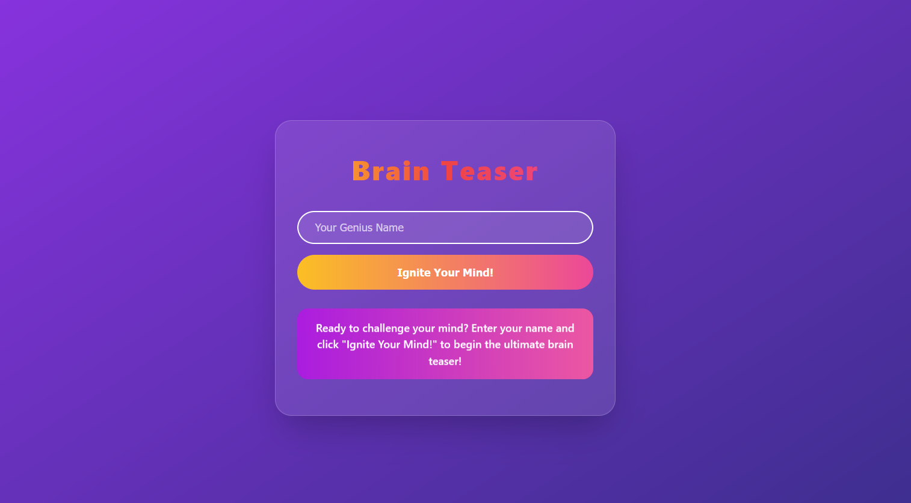

# Brain Teaser

## Project Overview

A dynamic quiz application that fetches trivia questions from an API and allows users to answer questions, track their score, and view a leaderboard. The app features a clean and responsive interface, with a name input form, question display, score tracking, and a leaderboard that shows top scores. The app also supports local storage for saving the leaderboard data.

## Features
- Fetches quiz questions from an external API (Open Trivia Database).

- Users can input their name to start the quiz.

- Displays questions with multiple-choice answers.

- Tracks the score in real-time.

- Shows a leaderboard of top scores, saved in the browser's local storage.

- Ability to restart the quiz and clear the leaderboard.

## Tech Stack
- HTML: For structuring the application.

- CSS: For styling the app and making it responsive.

- JavaScript: For the app's logic, including fetching data from the API, processing the quiz, and updating the UI.

- HE Library: To decode HTML entities in the quiz data (fetched from the API).

## How to Use
- Enter your name in the input field.

- Click "Start Quiz" to begin answering questions.

- Select an answer from the multiple-choice options.

- After answering all the questions, your score will be displayed along with a leaderboard of top scores.

## Future Enhancements
- Allow users to select specific categories of questions (e.g., general knowledge, science, entertainment).
- Introduce a countdown timer for each question to add a time challenge element to the quiz.

## Live Link
Feel free to check it out and let me know what you think!

https://eriqmoore.github.io/Brain-Teaser/

## Acknowledgments
- Open Trivia Database for providing the trivia questions API. https://opentdb.com/
- HE Library for decoding HTML entities in the quiz data. https://www.npmjs.com/package/he

